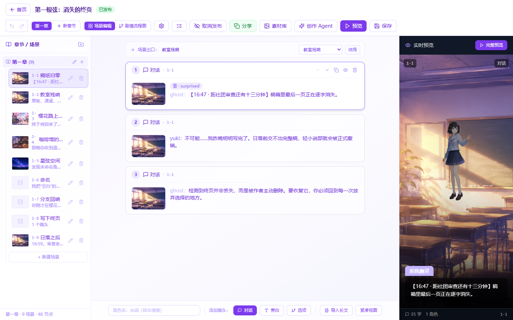
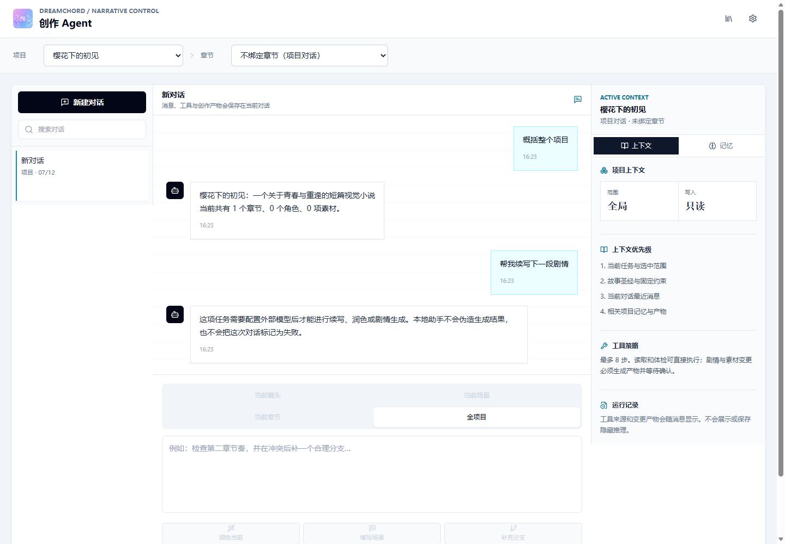

# 梦弦 DreamChord 0.2

DreamChord 是一套本地运行的视觉小说创作工作台。它把章节、场景、镜头卡、角色、背景、分支剧情、实时预览、素材处理和创作 Agent 放在同一个项目里，作者不需要编写脚本也能完成可播放的故事。

[在线项目展示](https://tl66666.github.io/DreamChord/) · [架构交接说明](docs/AI_HANDOFF.md) · [长篇故事工作流](docs/LONG_STORY_WORKFLOW.md)



## 已有能力

- 以“章节 → 场景 → 镜头卡”为主线编辑对话、旁白、角色出入场、表情、背景和转场。
- 创建选项、分支、跳转和汇合，并用剧情流程图检查整部故事。
- 场景实时预览、完整播放、发布和分享。
- 50 步撤销/重做、串行自动保存、版本冲突保护和未保存离开提醒。
- 导入长篇文本前先解析和预览，由作者确认后再写入项目。
- 项目备份与恢复会携带上传素材，并重新生成安全的项目 ID 和文件路径。
- 账号级全局素材库：素材上传一次即可在名下所有故事中复用，并可重命名、替换和安全删除。
- 图片检查、白底处理、透明边缘裁切、立绘/CG/背景规格化和候选图审核。
- 多对话创作 Agent、项目级或章节级上下文、六类分层记忆、受限工具调用和参数自动修复。
- 未配置模型 API Key 时仍可使用本地助手概括项目、盘点素材、检查角色和剧情结构。
- 桌面、平板和手机宽度的响应式界面。

## Windows 一键启动

### 准备

- Windows 10 或 Windows 11。
- [Node.js 20 LTS 或更高版本](https://nodejs.org/)。
- 首次运行需要网络，用于安装锁定版本的依赖。
- 请下载或克隆完整仓库，不要只下载单个脚本。

### 启动步骤

1. 双击根目录的 `start-dreamchord.bat`。
2. 首次运行会安装依赖、创建本地配置、备份旧数据库、同步数据结构并写入演示数据。
3. 后端和前端就绪后，脚本会自动打开浏览器。
4. 使用演示账号登录：用户名 `demo`，密码 `demo123`。

项目目录可以放在任意位置，中文路径和带空格路径均可。脚本始终从自己的目录启动，不依赖开发者电脑上的绝对路径。

### 重复双击会怎样

启动器会先扫描本机端口，并通过 `/api/health` 的服务标识确认是否真的是 DreamChord：

- 前后端都已健康运行：直接打开现有页面，不重新安装，也不执行 Prisma Client 生成。
- 后端仍在运行但前端已失效：停止启动并用中文提示关闭旧服务窗口后重试。
- 没有运行中的 DreamChord：执行完整检查并启动新实例。
- 其他程序占用默认端口：不会结束该程序，而是选择可用端口。

这项判断专门避免 Windows 上常见的 `EPERM: operation not permitted, unlink query_engine-windows.dll.node`。该错误表示旧后端仍占用 Prisma 的查询引擎 DLL，换一个后端端口并不能解除文件锁。

只检查安装和数据库，不启动页面：

```powershell
powershell -ExecutionPolicy Bypass -File .\start-dreamchord.ps1 -SetupOnly
```

如果 DreamChord 后端正在运行，安装检查会要求先关闭旧服务窗口，因为升级需要更新 Prisma Client。

环境诊断：

```powershell
powershell -ExecutionPolicy Bypass -File .\scripts\doctor.ps1
```

## 从零完成一个故事

1. 在首页新建项目，或打开官方演示项目查看完整范例。
2. 进入故事工作台，选择章节和场景。
3. 新建场景。场景会带一个可预览的默认背景，不会出现空白破图。
4. 编辑镜头卡的说话人、表情、站位、对白或旁白。
5. 需要互动时添加选项，为每个选项创建目标场景；也可以让多个分支汇合。
6. 在右侧实时预览当前场景，切换到剧情流程图检查断路、死路和错误跳转。
7. 使用“完整预览”从入口开始试玩，确认选择、跳转、角色和画面都正确。
8. 发布后复制分享链接，或从首页导出项目备份。

编辑器会自动保存。保存冲突时不会用旧版本覆盖新内容；应重新打开项目，确认最新版本后继续编辑。

## 用户素材如何进入故事

### 背景和 CG

1. 在镜头卡的背景区域打开全局素材库。
2. 上传图片，类型可选“背景”或“CG”。
3. 打开图片处理，查看透明度、边缘亮度、底色复杂度和推荐用途分析。
4. 生成背景或 CG 候选图，预览后选择“接受”。原图不会被覆盖。
5. 回到当前镜头，从“背景 / CG”列表选择刚接受的素材。它也会出现在其他故事的素材选择器中。
6. 画面会立即进入镜头卡、实时预览、自动保存和完整播放器。

CG 在故事里按全屏场景画面使用，因此与背景共用稳定的渲染和保存路径。

### 角色立绘

1. 把人物源图上传到“角色 / CG”分类。
2. 先执行图片检查，再选择立绘处理方案。
3. 为候选图填写有效角色名和表情名，生成透明 PNG 立绘。
4. 预览边缘和人物内容，确认无误后选择“接受到素材库”；此时不需要指定章节或角色。
5. 在故事编辑器中使用这张立绘时，再选择项目角色和表情并绑定。绑定后会立即进入镜头卡的角色、说话人和表情选择器，不需要刷新页面。

角色立绘使用“项目角色 → 表情 → 立绘文件”的绑定方式，不会把任意 CG 地址直接塞进角色节点，因此项目备份、替换和播放时关系仍然完整。

## 上传什么图片效果最好

### 最推荐：透明背景 PNG

人物已经带透明通道时最稳定。系统只需检查、裁边和规格化，不需要猜测人物与背景的分界。

### 可以处理：白色或浅色纯背景

白底、浅灰底或颜色基本一致的棚拍图适合边缘连通的底色消除。处理算法从图片边缘向内移除相近底色，封闭在人物内部的白衣、眼白和高光不会因为“颜色是白色”就被整块删除。作者仍应在接受前检查头发、半透明饰品和浅色轮廓。

拍摄或生成源图时建议：

- 人物与背景有明显明暗或色相差异；
- 背景平整、没有阴影、地面线和道具；
- 人物四周留出空间，不要切掉头发、手和服装边缘；
- 尺寸尽量清晰，避免低分辨率截图和严重压缩。

### 需要谨慎：复杂真实背景

树林、房间、街道、渐变光影和人物颜色接近的背景，不适合只靠边缘底色算法精准抠图。DreamChord 会识别为复杂背景、降低置信度并给出警告，可以生成候选供审核，但不会假装具备可靠的语义分割能力。此类图片最好先用专业抠图工具得到透明 PNG，再导入 DreamChord。

## 图片处理安全边界

- 服务端使用 Sharp 解码真实图片内容，不信任文件扩展名或浏览器声明的 MIME。
- 畸形、超大、像素规模异常或不支持的文件会在处理前拒绝。
- 原始上传始终保留。
- 衍生图先进入 `proposed` 候选状态，只有作者接受后才成为正式素材。
- 立绘输出为透明 PNG，目标画布 `1024 × 1536`。
- CG 和背景输出为 WebP，目标画布 `1920 × 1080`。
- 已被角色表情引用的文件不会被直接删除；未引用的原图和候选通过服务层清理。

## 创作 Agent



Agent 不是一次性聊天框。每个项目可以新建、重命名、置顶、搜索和删除多个对话，不同对话可以分别负责续写、人物塑造、支线修补、剧情审查或素材准备。新对话默认不绑定章节，适合讨论整部作品；需要续写或修改剧情时，再从上下文选择器绑定具体章节。

运行时会组合当前对话历史和滚动摘要、项目与章节、所选场景、剧情图、故事圣经、分层记忆、项目角色、素材和剧情健康报告。

六类记忆为 `canon`（世界事实）、`character`（角色）、`plot`（剧情线）、`decision`（创作决定）、`preference`（作者偏好）、`artifact`（已应用成果）。记忆可以是建议、已启用或已遗忘；建议不会静默升级成官方设定，不同对话的私有记忆也不会泄漏到其他对话。

Agent 可以调用受限工具读取章节、检查剧情、提出结构化补丁，以及检查和准备立绘、CG、背景。模型偶尔返回字段别名或不完整参数时，运行器会在约束范围内自动规范化并最多修复两次；无法确定唯一素材时会要求明确目标，不会把原始校验错误抛给作者。它不能调用任意 shell、文件系统或数据库，也不能绕过审核：

```text
读取上下文 → 制定计划 → 调用允许的工具 → 校验结果
→ 生成提案 → 作者预览 → 应用 / 拒绝 → 必要时撤销
```

图片工具同样只生成候选，不能替作者自动接受。API Key 只用于当前请求，不会写进项目记录或 Agent 对话正文。

## 模型配置

基础故事编辑、剧情体检、图片处理、备份恢复和播放器都不需要模型 API Key。没有配置 Key 时，Agent 自动使用 `dreamchord-local` 本地助手，可概括项目、盘点素材与角色、检查剧情图，并给出图片导入建议；这类检查不会访问外部模型。

续写正文、改写对白、生成分支等开放式创作需要外部模型。此时本地助手会把缺少的配置和下一步说清楚，对话仍会正常完成，不会显示“任务失败”。

在设置页可以配置 GLM、DeepSeek、Kimi、OpenAI 或其他 OpenAI 兼容接口。服务端默认配置可参考 `apps/server/.env.example`。不要把 `.env` 或 API Key 提交到 Git。

## 本地数据、备份与隐私

- 默认数据库是 `apps/server/prisma/dev.db`，上传文件保存在本地上传目录。
- 一键启动器在数据库结构同步前，为非空 SQLite 数据库保留按 schema 版本验证的快照。
- 项目导出使用版本化 `dreamchord-project` 清单并携带该故事实际引用的素材字节、哈希和 MIME 信息，包括从全局库复用、最初由其他故事上传的素材。
- 导入会校验大小和内容，创建新项目并重映射内部引用，不会把外部数据库 ID 直接写进现有项目。
- 除了作者主动配置的模型请求，故事和素材默认不上传到第三方云服务。

不要提交 `.env`、SQLite 数据库、`uploads/`、日志、构建产物或包含密钥的文件。

## 常见问题

### 双击后出现 Prisma `EPERM unlink`

先关闭旧的 DreamChord 后端和前端命令窗口，再双击启动脚本。新版启动器会优先复用健康实例，并在只有旧后端残留时提前阻止 Prisma 操作。如果仍有问题，运行 `scripts\doctor.ps1`，把带 `[FAIL]` 或 `[WARN]` 的中文结果用于排查。

### 页面没有自动打开

查看脚本末尾打印的“前端”地址并手动打开。若只看到后端正在运行的提示，关闭旧服务窗口后重新双击。

### 首次安装失败

确认 Node.js 至少为 20，恢复网络后重试。项目固定使用 `pnpm 9.1.0`，启动器会通过 Corepack 启用它，不要在子目录单独生成锁文件。

### 素材上传后找不到

素材上传后进入账号的“全局素材”库，不属于某个章节。背景和 CG 可从任意故事镜头卡的“背景 / CG”入口选择；立绘先接受到素材库，再在目标故事里绑定角色和表情。被故事或角色引用的素材不能直接删除，界面会说明引用位置，避免作品出现破图。

## 手动开发

```bash
corepack enable
corepack prepare pnpm@9.1.0 --activate
pnpm install --frozen-lockfile
pnpm --filter dreamchord-server prisma generate
pnpm --filter dreamchord-server prisma db push --accept-data-loss
pnpm --filter dreamchord-server prisma db seed
pnpm dev
```

默认地址：

- 前端：`http://localhost:5173`
- API：`http://localhost:3001`
- 演示账号：`demo / demo123`

手动升级数据库前可先备份：

```powershell
powershell -ExecutionPolicy Bypass -File .\scripts\backup-local-database.ps1 -EnvPath .\apps\server\.env -SchemaPath .\apps\server\prisma\schema.prisma
```

## 项目结构

```text
apps/web                 React + TypeScript + Vite 前端
  src/editor             场景、镜头卡、流程图、自动保存
  src/agent              多对话 Agent、提案和记忆中心
  src/assets             图片处理审核界面
  src/player             视觉小说播放器

apps/server              Express + Prisma + SQLite 后端
  src/agent              上下文、记忆、工具、补丁应用与撤销
  src/assets             Sharp 图片检查和处理
  src/routes             认证和 HTTP API
  prisma                 数据结构与幂等演示数据

packages/story-domain    前后端共享的剧情图、补丁和健康规则
scripts                  启动诊断、环境配置和数据库备份
docs                     展示页、截图、设计和交接文档
```

## 质量检查

```bash
pnpm lint
pnpm test
pnpm build
pnpm test:readiness
git diff --check
```

测试覆盖剧情规则、保存冲突、Agent 对话和记忆隔离、上下文装配、工具调用、补丁应用/撤销、图片处理、备份恢复、编辑器历史、自动保存、响应式布局和核心界面流程。

## 相关文档

- [AI 与架构交接](docs/AI_HANDOFF.md)
- [长篇故事工作流](docs/LONG_STORY_WORKFLOW.md)
- [场景编辑器设计](docs/scene-editor-design.md)
- [角色资料](CHARACTERS.md)
- [素材资料](ASSETS.md)
- [立绘规范](SPRITE_ASSET_STANDARD.md)
- [官方演示剧情](DEMO_STORY.md)

## 许可证

MIT
