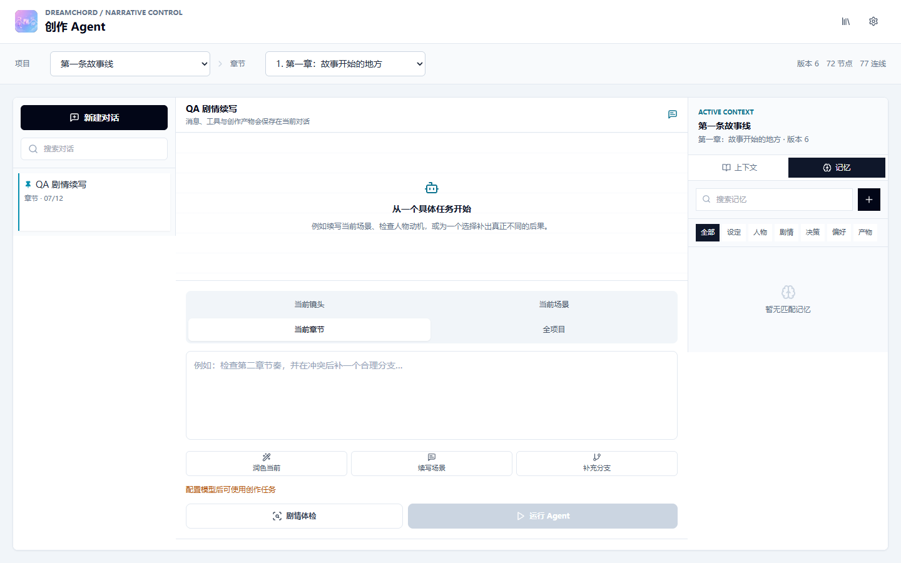
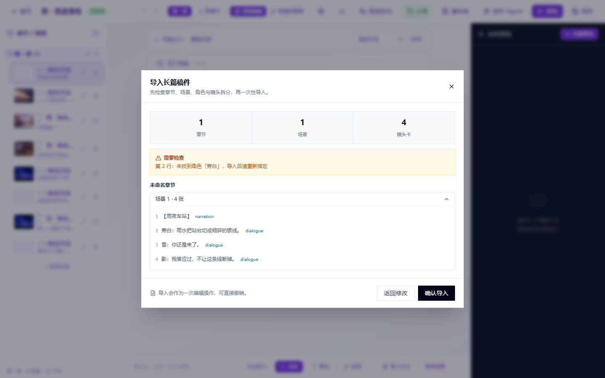
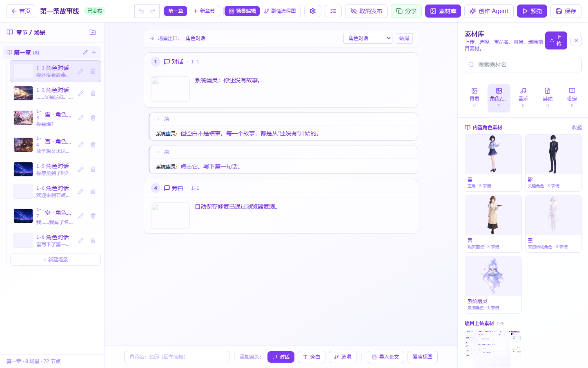

# DreamChord 0.2

DreamChord is a browser-based visual novel studio for writing, structuring, testing, and publishing branching stories. It combines a scene-card editor, playable runtime, project asset pipeline, and a tool-using creative Agent with layered memory.

[Project showcase](https://tl66666.github.io/DreamChord/) | [Architecture handoff](docs/AI_HANDOFF.md) | [Long-form workflow](docs/LONG_STORY_WORKFLOW.md)


## What Is Included

- Chapter -> scene -> shot-card story editing without requiring script syntax.
- Dialogue, narration, character staging, background changes, choices, branches, and convergence.
- Story flowchart, health checks, live preview, full player, publish/share flow.
- 50-step undo/redo, serialized autosave, version-conflict detection, and dirty-navigation protection.
- Structured manuscript parsing with review-before-import.
- Project backup export/import with strict validation and ID remapping.
- Built-in and uploaded asset library with rename, replacement, deletion, and target-aware selection.
- Safe image preparation using Sharp: decoded image validation, white-matte removal, feathering, trimming, sprite/CG/background presets, and reviewable derived variants.
- Responsive editor and Agent workspace for desktop, tablet, and mobile widths.

## Creative Agent

The Agent is not a one-shot text box. It is a bounded workflow that reads project context, plans work, calls approved tools, produces a structured patch, validates the result, and waits for the author to apply or reject it.


### Conversations

- Create, rename, pin, search, and delete independent conversations.
- Each conversation keeps its own transcript, rolling summary, scope, and memory context.
- Use separate conversations for continuation, character work, branch repair, plot review, or asset preparation.

### Layered Memory

Memory kinds:

- `canon`: world rules and immutable facts
- `character`: goals, voice, secrets, relationships
- `plot`: unresolved threads and causal state
- `decision`: accepted creative decisions
- `preference`: author style and workflow preferences
- `artifact`: applied patches and generated project artifacts

Memory states are `suggested`, `active`, and `forgotten`. Memories carry provenance, importance, pin state, project/conversation ownership, and ranking metadata. Suggested memories do not silently become canon.



### Agent Tools And Safety

The runtime can read conversation history, project context, Story Bible data, ranked memories, assets, character profiles, chapter graphs, and health reports. It can propose bounded story changes and image-preparation jobs.

Important rules:

- Model output never writes directly to the story database.
- Story changes are validated as structured patches.
- The author previews the diff before applying it.
- Applying a patch creates a snapshot and can be undone while the chapter version is still compatible.
- Image work remains proposed until accepted; originals are preserved.
- API keys are used for the active request and are not persisted in project records or Agent transcripts.

## Story Editor



The default editor is organized around writing rather than raw graph manipulation:

1. Pick a chapter and scene.
2. Add or edit shot cards.
3. Assign characters, expressions, backgrounds, text, and choice destinations.
4. Inspect the generated flow or run project health checks.
5. Preview the scene or play the published story.

Autosave is version-safe. The client sends only the strict save body (`baseVersion`, `nodes`, `edges`), the server atomically claims the expected chapter version, and stale saves return a conflict instead of overwriting newer work.

## Asset Processing



Uploaded images are decoded and inspected rather than trusted by file extension. The processing studio supports:

- Sprite output: transparent PNG, normalized to 1024x1536.
- CG/background output: WebP, normalized to 1920x1080.
- White-background removal with adjustable threshold and feathering.
- Transparent-edge trimming.
- Proposed, accepted, and rejected variant lifecycle.
- Character and expression binding for accepted sprites.

## One-Click Start On Windows

Requirements: Windows 10/11, Node.js 20 or newer, and network access on the first run.

1. Download or clone the complete repository.
2. Double-click `start-dreamchord.bat`.
3. Wait for the browser to open.
4. Sign in with `demo` / `demo123`.

The launcher:

- runs from its own directory, so the repository may be placed anywhere;
- checks Node.js and enables the pinned pnpm version through Corepack;
- installs the frozen workspace lockfile;
- creates a local `.env` only when missing and preserves existing secrets;
- chooses free backend and frontend ports;
- applies Prisma migrations and idempotent demo seeding;
- waits for both services before opening the browser.

Setup-only verification:

```powershell
powershell -ExecutionPolicy Bypass -File .\start-dreamchord.ps1 -SetupOnly
```

## Manual Development

```bash
corepack enable
corepack prepare pnpm@9.1.0 --activate
pnpm install --frozen-lockfile
pnpm --filter dreamchord-server prisma generate
pnpm --filter dreamchord-server prisma migrate deploy
pnpm --filter dreamchord-server prisma db seed
pnpm dev
```

Default addresses:

- Web: `http://localhost:5173`
- API: `http://localhost:3001`
- Demo account: `demo` / `demo123`

If a default port is occupied, use the one-click launcher or set `PORT` and `VITE_API_TARGET` explicitly.

## Model Configuration

The web settings page supports OpenAI-compatible providers such as GLM, DeepSeek, Kimi, and OpenAI-compatible endpoints. Basic editing, deterministic health checks, backup/restore, and asset processing work without an LLM key. Agent generation requires a configured provider.

Server-side defaults may be placed in `apps/server/.env`; use `apps/server/.env.example` as the template. Never commit `.env`, databases, upload directories, or API keys.

## Architecture

```text
apps/web                 React 18 + TypeScript + Vite
  src/editor             scene-card editor, history, autosave, import preview
  src/agent              conversations, transcript, Agent UI, memory center
  src/assets             image processing review UI
  src/player             visual novel runtime and player

apps/server              Express + Prisma + SQLite
  src/agent              context, tools, planning, patch validation, apply/undo
  src/routes             authenticated HTTP boundaries
  src/assets             safe Sharp-based inspection and transformations
  prisma                 schema, migrations, idempotent demo seed

packages/story-domain    shared graph schemas, patch rules, health analysis
```

The shared story-domain package is the contract between browser, server, Agent tools, and tests. Extend it before adding ad hoc graph shapes in a feature module.

## Quality Checks

```bash
pnpm lint
pnpm test
pnpm build
pnpm test:readiness
git diff --check
```

The repository includes unit and integration coverage for story rules, save conflicts, Agent conversations, memory isolation/ranking, context assembly, tool execution, patch apply/undo, image processing, backup/restore, editor history, autosave coordination, responsive navigation, and core UI workflows.

## Repository Rules

- Use `pnpm` from the repository root; do not create nested lockfiles.
- Keep story mutations versioned and validated.
- Keep Agent actions proposed until explicit acceptance.
- Preserve original uploaded assets.
- Use structured parsers and Zod schemas at HTTP boundaries.
- Do not commit `.env`, `dev.db`, `uploads/`, logs, build output, or downloaded model data.

## Main Docs

- [AI and architecture handoff](docs/AI_HANDOFF.md)
- [Long story workflow](docs/LONG_STORY_WORKFLOW.md)
- [Scene editor design](docs/scene-editor-design.md)
- [Character reference](CHARACTERS.md)
- [Asset reference](ASSETS.md)
- [Sprite standard](SPRITE_ASSET_STANDARD.md)
- [Demo story](DEMO_STORY.md)

## License

MIT
